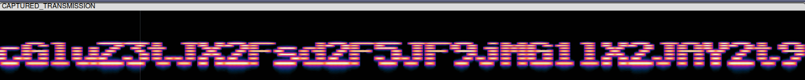
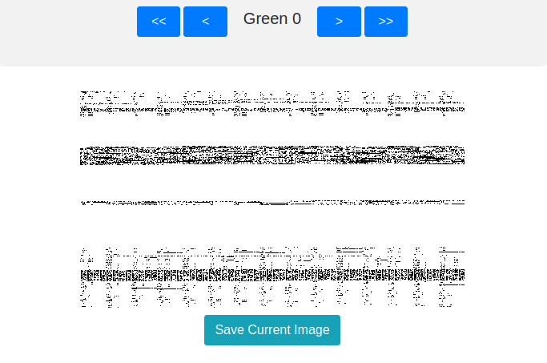
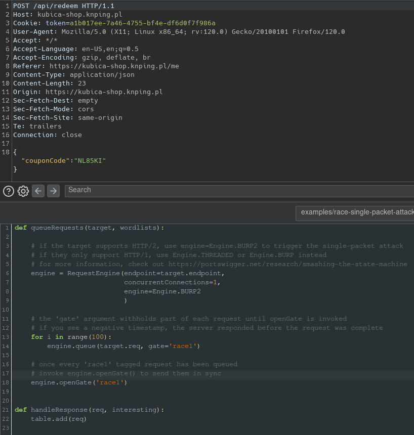

Hosted by: [PING](https://knping.pl/) 

Duration: Fri, 08 Dec. 2023, 17:30 UTC — Sun, 10 Dec. 2023, 22:00 UTC

CTFtime: [pingCTF 2023](https://ctftime.org/event/1987)

Team: [Wojownicy z Piwnicy](https://ctftime.org/team/155060)

Result: 1st place in regional Polish ranking & 3rd place in International ranking


> Disclaimer: I'm also including challenges originally solved by other team members. However, all of them have been later solved by myself. 


Challenges:
1. [internet-explorer](#internet-explorer)
2. [noodle-nightmare](#noodle-nightmare)
3. [youtube-trailer](#youtube-trailer)
4. [inside-bear](#inside-bear)
5. [wow](#wow)
6. [you-spin-me-round](#you-spin-me-round)
7. [imag-ine-an-elf](#imag-ine-an-elf)
8. [ziggarettes](#ziggarettes)
9. [kubica-shop](#kubica-shop)

---

## Internet Explorer
We were given a website without source code, along with a written clue: "Can you run Internet Explorer on Linux?" Solving this challenge involved changing the user agent to one matching IE but keeping the OS as Linux. This can be achieved using tools such as curl, manual request editing (e.g., with Burp Suite), or even a browser extension.
```bash
❯ curl -A 'Mozilla/5.0 (Linux; WOW64; Trident/7.0; rv:11.0) like Gecko' https://internet-explorer.knping.pl
https://internet-explorer.knping.pl
Flag = <b>ping{ping{the_best_browser_ever_made111}}<b/>
```
Solved by: 
GARN3K

## Noodle Nightmare 
Source code for the challenge contained a file called 'noodleNightmare.cpp' containg a lot of includes. Each include contains a single character like '=', '{', '_' and many mores. 
```cpp
#include<iostream> 

#include "spaghetti/tjzqohinnyywacrdplxojvooeckayonrdmaycbqcvvxbkibbvv.cpp"

#include "spaghetti/pypqtzzchhewyfazdybbzhhkyonlnnpuwsxvydmbukjmdxyxfs.cpp"

#include "spaghetti/xwyqezbcclhfyrrruglguuonewdbimuzajxwwospbsybsxwily.cpp"
```
When executing the file it waits for the user input, and then gives you a response. 
```
❯ ./executable
People always say that my code is spaghetti, but I don't see it. Can you help me find the flag?
a
Not this time!
```
We can compile the program with the '-g' option which enables the use of extra debugging information that gdb can use. After that we use Ghidra to analyze the file and find the code fragment responsible for printing the flag out. We can then set a breakpoint in gdb for the == operator. With that we receive the flag as right hand side of the equation. 

```cpp
bVar2 = std::operator==(local_68,(basic_string *)local_48);
if (bVar2) {
  pbVar3 = std::operator<<((basic_ostream *)std::cout,
                           "Congratulations, you have untangled this spaghetti!");
  std::basic_ostream<>::operator<<((basic_ostream<> *)pbVar3,std::endl<>);
}
else {
  pbVar3 = std::operator<<((basic_ostream *)std::cout,"Not this time!");
  std::basic_ostream<>::operator<<((basic_ostream<> *)pbVar3,std::endl<>);
}
```


```bash
(gdb) break operator==
Breakpoint 1 at 0x2fc1: file /usr/include/c++/13.2.1/bits/basic_string.h, line 3702.
(gdb) r
Starting program: /ctf/ping2023/noodle-nightmare/executable 
People always say that my code is spaghetti, but I don''t see it. Can you help me find the flag?
a

Breakpoint 1.1, std::operator==<char, std::char_traits<char>, std::allocator<char> > (__lhs="a", 
		__rhs="ping{it_is_bad_when_code_is_easier_to_read_in_assembly}") at /usr/include/c++/13.2.1/bits/basic_string.h:3702
3702	     return __lhs.size() == __rhs.size()
```

Solved by: 
Bonus

## YouTube Trailer
A simple misc challenge where we have been given a link to a [YouTube video](https://www.youtube.com/watch?v=siZPvEGrtNY). The flag can be found by looking at the source code of the page. It's hidden in keywords and video tags. 
```html
"keywords":["ping","ctf","ping{hello_welcome_to_ping_ctf}"]
<meta property="og:video:tag" content="ping{hello_welcome_to_ping_ctf}">
```
Solved by: 
GARN3K

## Inside Bear
We received an executable ELF file printing 'Hi Mom' upon execution. With binwalk we were able to extract additional files from a ZIP archive. 
```bash
❯ binwalk -e look-inside

DECIMAL       HEXADECIMAL     DESCRIPTION
--------------------------------------------------------------------------------
0             0x0             ELF, 64-bit LSB shared object, AMD x86-64, version 1 (SYSV)
15968         0x3E60          Zip archive data, at least v2.0 to extract, compressed size: 177574, uncompressed size: 338732, name: inside/CAPTURED_TRANSMISSION.wav
193604        0x2F444         Zip archive data, at least v2.0 to extract, compressed size: 325736, uncompressed size: 327800, name: inside/static.ogg
519387        0x7ECDB         Zip archive data, at least v2.0 to extract, compressed size: 791646, uncompressed size: 795282, name: inside/you-died.gif
1311288       0x140238        End of Zip archive, footer length: 22
```
The file that interests us is the 'CAPTURED_TRANSMISSION.wav' file. If we inspect it's spectrogram (e.g. in Audacity) we can see the hidden message. It' encoded in base64, co we also need to decode it to receive the flag. 



```bash
❯ echo 'cGluZ3tJX2Fsd2F5JF9jMG1lX2JAY2t9' | base64 -d
ping{I_alway$_c0me_b@ck}
```
Solved by: agr0chal & GARN3K 


## Wow
We receive a program written in python that contains the game death roll. The rules we are presented with are as followed:
>Welcome to the death roll!
it is a game that is common in WoW game on chat to risk or double your gold!
short example on how it works:
you have 50 gold
you can bet 1-50 gold
First roll is random number from 1 to 100
when you roll 47 then the opponent rolls from 1 to 47
when opponent roll 20 then you roll from 1 to 20
the person who gets to roll 1 loses the money

When we inspect the python program we discover that seeds generated for the game only come from values inside of 0 - 10 000 000 range. Such a small number of seeds leaves the game vulnerable to brute-force attack. We can generate the seeds in advance and then search for it while playing the game. 

```python
random.seed(random.randint(0, 10_000_000))
```


```python
import os
import random
import json 
dict = {}

def roll(n: int):
    return random.randint(1, n)


for i in range(10000001):
    random.seed(i)
    dict[i]=[]
    for j in range(24):
        number = 100
        while(True):
            number = roll(number)
            dict[i].append(number)
            if number == 1:
                break
        if len(dict[i]) >= 24:
            break
    if i%100000 == 0:
        print(i)
with open("ditc.txt", "w") as my_file:
    my_file.write(json.dumps(dict))
```
```python
import json
import copy
with open("ditc.txt") as file:
    ditc = json.load(file)
index = 0
while(True):
    number = int(input("Day"))
    left = copy.deepcopy(ditc)
    for key, value in ditc.items():
        if not value[index] == number:
            del left[key]
    ditc = left
    index +=1
    print(len(ditc.keys()))
    if len(ditc.keys()) == 1:
        print(ditc)
```
```python
import os
import random
import json 
dict = {}

def roll(n: int):
    return random.randint(1, n)


for i in range(1):
    random.seed(7198161)
    dict[i]=[]
    for j in range(240):
        number = 100
        rounds = 0
        while(True):
            rounds +=1
            number = roll(number)
            dict[i].append(number)
            if number == 1:
                if rounds%2 != 0:
                    print(str(j)+"win")
                    break
                else:
                    print(str(j)+"lose")
                    break
```
It's not the most elegant solution, do to copying the whole dictionary to memory, but it works well enough with 16GB of ram. When we have discovered the seed, we can calculate which rounds will we win, and which ones will we loose. In the winning rounds we bet all of our money, while in the losing rounds we only bet 1 coin. After enough rounds we do beat the opponent and get the f

```bash
How much do you want to bet? 2869491
opponent rolls 75

suser rolls 71

opponent rolls 33

user rolls 2

opponent rolls 1

You won!
FLAG='ping{13ts_pldy_sOm3_wlw_:)))}'
```
Solved by: Meist3r & agr0chal & GARN3K 

## You Spin Me Round
We yet again receive a python app that requires input from us. This time it's asking for mathematical equations. There are 3 tasks, that require different calculations with random numbers. 
>  Hello, I am a bot that can spin you round, baby, right round, like a record, baby, right round, round, round.

>BEEP BEEP BEEP BEEP BEEP BEEP BEEP BEEP BEEP BEEP BEEP BEEP BEEP BEEP BEEP 
BEEP BEEP BEEP BEEP BEEP BEEP BEEP BEEP BEEP BEEP BEEP BEEP BEEP BOOP BOOP BOOP BOOP BOOP BOOP BOOP BOOP BOOP BOOP BOOP BOOP BOOP BOOP BOOP BOOP BOOP BOOP BOOP BOOP BOOP BOOP BOOP BOOP BOOP BOOP BOOP BOOP BOOP BOOP BOOP BOOP BOOP

>PLEASE ENTER CORRECT SOLUTIONS TO AUTHORIZE:

>Task 1: 4824 // ? = 57  

>Task 2: 6917966.55 % ? = 75.44999999965447

>Task 3: 6626698.4 % 990.43 = ?

However to Task 3, there is an additional requirement. We need to ensure that the string of our solution does not equal the expected solution but the float does. We can bypass that by adding '000000000000000000000000000001' to the string, ensuring it's different but floats are rounded to a specific precision. 
```python
else:
opt_text = f'This is a special case! You need to satisfy the following condition to pass it."'
opt_text += f'\n"{user_solution}" != str({solution}) and float("{user_solution}") == {solution} and not “{user_solution}".endswith("0")"
m_incorrect(user_solution, solution, opt_text)
exit(1)
```
After solving 3 tasks we arrive at task 4. It requires solving 996 randomly selected tasks (styles from 1 to 3) in less than 10s. To fit that time limit we had to create a dictionary for the 2nd task style, since the calculations were taking too long. With that we were able to complete the task in the given time. 

>Good job! :) You proved you are a human!!!
However unfortunately this is not enough to get the flag. As friendly as I am, I can onl
y provide the flag to the fellow bots.
To prove it you need to solve task 4 in a limited time.

>START
Task 4: 5607152.76 % 321.05 = ?

Our solution with the netcat connection implemented:
```python
from pwn import *

nc = remote('you-spin-me-round.knping.pl', 20000)

pattern1 = r'(\d+) // \? = (\d+)'
pattern2 = r'[-+]?\d*\.\d+|\d+'

pat1 = re.compile(pattern1)
pat2 = re.compile(pattern2)

dict = []

for i in range(1,100000):
        x = i / 100
        dict.append(x)

while 1:
        data=nc.recvline().decode()
        if "FLAG=" in data:
                print(data)

        if "// ? =" in data:
                matches = pat1.findall(data)
                first_number = int(matches[0][0])
                second_number = int(matches[0][1])
                res = int(first_number/second_number)
                nc.send(str(res) + '\n')
        if " % ? =" in data:
                matches = pat2.findall(data)
                first = float(matches[1])
                second = float(matches[2])
                for y in dict:
                        res = first % y
                        if(res == second):
                                nc.send(str(y) + '\n')
                                break;
        if " = ?" in data:
                matches = pat2.findall(data)
                first = float(matches[1])
                second = float(matches[2])
                res = first % second

                nc.send(str(res) + '000000000000000000000000000000000000000001\n')
nc.close()
```

What we missed, was a simpler, faster solution. The opening BEEPs and BOOPs were generated randomly. Given the seed was taken only from a range of 1 - 1 000 000 we could have yet again brute-force the seed and predict the questions given to us. This would eliminate the time constrain that was given, since all the answers would already be calculated. This solution would be needed if the organizers gave us less time or there were more questions. 
```python
seed = random.randint(0, 1_000_000)
random.seed(seed)
hello(random.randint(1, 100), random.randint(1, 100))
```
Solved by: Meist3r & agr0chal & GARN3K 

## Imag-ine an Elf
We were given, a .png file containing a combination of diffrent color pixels. Default checks for messages hidden inside photographs using steganography tools did not bring any results. 


However an online website [StegOnline](#https://georgeom.net/StegOnline/image) provided us with the option of browsing indivudal Bit Planes. One of the green planes looked diffrent from the rest. The same website allowed us to extract the data from only this plane, giving us an Executable and Linkable Format (ELF) file. 



We then placed the file to Ghidra treating it like a normall RE challenge. Executable was taking users input, and then checking individual indexes with series of XOR and +/- operations. 

```c
  if (sVar1 == 0x22) {
    local_98[0] = 0x60;
    local_98[1] = 0x135e;
    local_98[2] = 0x5e;
    local_98[3] = 0x54;
    local_98[4] = 0x6b;
    local_98[5] = 0x72;
    local_98[6] = 0x21;
    local_98[7] = 0x1302;
    local_98[8] = 0x33;
    local_98[9] = 0x6c;
    local_98[10] = 0x24;
    local_98[11] = 0x1359;
    local_98[12] = 0x54;
    local_98[13] = 0x1368;
    local_98[14] = 0x62;
    local_98[15] = 0;
    local_98[16] = 0x46;
    local_98[17] = 0x1368;
    local_98[18] = 0x67;
    local_98[19] = 0x1304;
    local_98[20] = 0x5c;
    local_98[21] = 0x5f;
    local_98[22] = 0x4f;
    local_98[23] = 0x1343;
    local_98[24] = 0x58;
    local_98[25] = 0x39;
    local_98[26] = 0x44;
    local_98[27] = 6;
    local_98[28] = 0x4f;
    local_98[29] = 0x1345;
    local_98[30] = 0x24;
    local_98[31] = 0x1345;
    local_98[32] = 0x23;
    local_98[33] = 0x4e;
    for (local_9c = 0; (int)local_9c < 0x22; local_9c = local_9c + 1) {
      if ((local_9c & 1) == 0) {
        if ((int)param_1[(int)local_9c] - 0x10U != local_98[(int)local_9c]) {
          puts("Wrong!");
          goto LAB_001014cd;
        }
      }
      else if ((int)local_9c % 3 == 0) {
        if ((int)(char)(param_1[(int)local_9c] ^ 0x33) != local_98[(int)local_9c]) {
          puts("Wrong!");
          goto LAB_001014cd;
        }
      }
            else if ((int)local_9c % 5 == 0) {
        if ((int)param_1[(int)local_9c] + 5U != local_98[(int)local_9c]) {
          puts("Wrong!");
          goto LAB_001014cd;
        }
      }
      else if (((int)param_1[(int)local_9c] ^ 0x1337U) != local_98[(int)local_9c]) {
        puts("Wrong!");
        goto LAB_001014cd;
      }
    }
```

Since in the code above we were given values that our inputs are being compared to, and also the operations that are executed on user inputs we could create a simple script reversing those operations on the starting values. 
```python
final = [96, 4958, 94, 84, 107, 114, 33, 4866, 51, 108, 36, 4953, 84, 4968, 98, 0, 70, 4968, 103, 4868, 92, 95, 79, 4931, 88, 57, 68, 6, 79, 4933, 36, 4933, 35, 78]

flag = []

for i in range(34):
    if i % 2 == 0:
        flag.append(chr(final[i] + 0x10))
    elif i % 3 == 0:
        flag.append(chr(final[i] ^ 0x33))
    elif i % 5 == 0:
        flag.append(chr(final[i] - 0x05))
    else:
        flag.append(chr(final[i] ^ 0x1337))

reversed_flag = ''.join(flag)
print("Reversed flag is:", reversed_flag)
-----------------------------------------------------------------------------------
Reversed flag is: ping{m15C_4nd_r3V_w3ll_th4T5_r4r3}
```
Solved by: RouNdeL

## Ziggarettes
Ziggarettes is a very simple reverse engineering challenge. We just import and analyze the provided executable in Ghidra and look at the function called in the entry. From there we can see that a loop iterates through user inputs and checks them against diffrent characters. We can manually go through the values and write down their indexes. After that we just need to join it into a single string to receive the flag. 

```c
      switch(uVar8) {
      case 0:
      case 0x20:
        if (cVar1 != 'p') goto LAB_00202677;
        break;
      case 1:
        if (cVar1 != 'i') {
		LAB_00202677:
		[...]
		}
        break;
      case 2:
        if (cVar1 != 'n') goto LAB_00202677;
        break;
      case 3:
        if (cVar1 != 'g') goto LAB_00202677;
        break;
      case 4:
        if (cVar1 != '{') goto LAB_00202677;
        break;
      case 5:
        if (cVar1 != 'z') goto LAB_00202677;
        break;
      case 6:
      case 9:
        if (cVar1 != '1') goto LAB_00202677;
        break;
      case 7:
        if (cVar1 != 'G') goto LAB_00202677;
        break;
      default:
        if (cVar1 != '_') goto LAB_00202677;
        break;
      case 10:
        if (cVar1 != 'S') goto LAB_00202677;
        break;
      case 0xc:
        if (cVar1 != 'v') goto LAB_00202677;
        break;
      case 0xd:
      case 0x17:
        if (cVar1 != '3') goto LAB_00202677;
        break;
      case 0xe:
        if (cVar1 != 'R') goto LAB_00202677;
        break;
      case 0xf:
        if (cVar1 != 'Y') goto LAB_00202677;
        break;
      case 0x11:
        if (cVar1 != 'C') goto LAB_00202677;
        break;
      case 0x12:
        if (cVar1 != '0') goto LAB_00202677;
        break;
      case 0x13:
      case 0x1e:
        if (cVar1 != 'O') goto LAB_00202677;
        break;
      case 0x14:
      case 0x21:
        if (cVar1 != 'l') goto LAB_00202677;
        break;
      case 0x16:
      case 0x1f:
        if (cVar1 != '2') goto LAB_00202677;
        break;
      case 0x18:
        if (cVar1 != '4') goto LAB_00202677;
        break;
      case 0x19:
        if (cVar1 != 'm') goto LAB_00202677;
        break;
      case 0x1a:
      case 0x1c:
        if (cVar1 != 'K') goto LAB_00202677;
        break;
      case 0x1b:
      case 0x1d:
        if (cVar1 != 'I') goto LAB_00202677;
        break;
      case 0x22:
        if (cVar1 != '}') goto LAB_00202677;
      }
```
```shell
0 1 2 3 4 5 6 7 8 9 10 11 12 13 14 15 16 17 18 19 20 21 22 23 24 25 26 27 28 29 30 31 32 33 34
p i n g { z 1 G _ 1  S  _  v  3  R  Y  _  C  0  O  l  _  2  3  4  m  K  I  K  I  O  2  p  l  }
----------------------------------------------------------------------------------------------
ping{z1G_1S_v3RY_C0Ol_234mKIKIO2pl}
```
Solved by: RouNdeL

## Kubica Shop
First step to solving this challenge was to register a new account. Every new user was given a unique discount code for 10$ which were added to his balance. We needed 1000$ to purchase the flag in the shop. Since we were given the website source code we could inspect the function called to redeem the coupons. 

```js
const saveOne = async (coupon) => {
	return new Promise((resolve, reject) => {
		db.run(
			`UPDATE coupons SET valid = ? WHERE id = ?`,
			[coupon.valid, coupon.id],
			(err) => {
				if (err) {
					return reject(new Error("Something went wrong"));
				}
				return resolve(coupon);
			}
		);
	});
};

const redeemOneByUserIdAndCode = async (userId, couponCode) => {
	return new Promise(async (resolve, reject) => {
		const coupon = await findByUserIdAndCode(userId, couponCode);
		if (!coupon) {
			return reject(new Error("Coupon not found"));
		}
		if (!coupon.valid) {
			return reject(new Error("Coupon already used"));
		}
		coupon.valid = false;
		await saveOne(coupon);
		await users.addBalance(userId, coupon.value);
		return resolve(coupon);
	});
};
```
We can see that the code is vulnerable and we can race conditions to redeem the coupon multiple times before it's marked as invalid. We need to send a lot of packets at once to trigger the redeem function to run multiple times (in our case it's 100 times). The diagram bellow sums it up pretty well.

>*Image taken from:[https://portswigger.net/research/smashing-the-state-machine](https://portswigger.net/research/smashing-the-state-machine)*


We can use an add-on in Burp Suite called Turbo Intruder which allows us to queue 100 requests and then send them all at once. First we capture the redeem request with proxy and send it to the Turbo Intruder. After that our balance should state 1000$ and we can purchase the flag. 


```shell
ping{tr4n54Ct1ons_4r3_L4444M3333333_4sync_R0ck5}
```
Solved by: Kacpal
